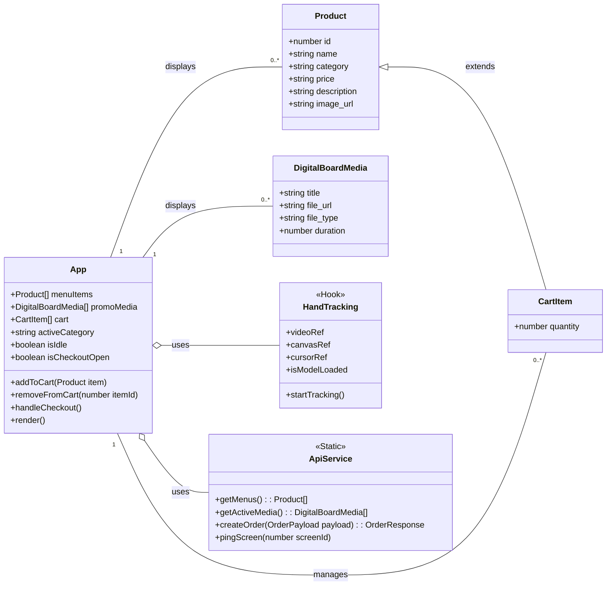

# Class Diagram

Berikut adalah Class Diagram yang merepresentasikan komponen utama, state, dan interaksi antar mereka di dalam aplikasi Kiosk.

## Diagram

## Penjelasan Class Diagram

1.  **`App`**:
    *   Ini adalah kelas utama yang merepresentasikan komponen utama aplikasi Anda.
    *   **Properties (State)**: Menyimpan semua state penting seperti `menuItems`, `cart`, `promoMedia`, dan status UI lainnya (`isIdle`, `isCheckoutOpen`).
    *   **Methods**: Berisi fungsi-fungsi utama untuk memanipulasi state, seperti `addToCart`, `removeFromCart`, dan `handleCheckout`.

2.  **`Product`**:
    *   Merepresentasikan struktur data untuk satu item menu yang didapat dari API.

3.  **`CartItem`**:
    *   Merupakan turunan (`extends`) dari `Product`.
    *   Memiliki semua properti dari `Product` ditambah dengan properti `quantity` untuk mencatat jumlah item yang dipesan di keranjang.

4.  **`DigitalBoardMedia`**:
    *   Merepresentasikan struktur data untuk media promosi (gambar/video) yang didapat dari Digital Board API.

5.  **`HandTracking`**:
    *   Direpresentasikan sebagai sebuah *Hook* (`<<Hook>>`) yang digunakan oleh komponen `App`.
    *   Bertanggung jawab untuk manajemen deteksi gestur, menyediakan referensi ke elemen video dan canvas.

6.  **`ApiService`**:
    *   Direpresentasikan sebagai kelas statis (`<<Static>>`) yang mengelompokkan semua pemanggilan API.
    *   Menyediakan method statis seperti `getMenus()`, `getActiveMedia()`, dan `createOrder()` yang bisa dipanggil dari mana saja, dalam hal ini oleh `App`.

### Hubungan Antar Kelas:

*   **`App` o-- `HandTracking` (uses)**: `App` menggunakan hook `HandTracking` untuk fungsionalitas gestur.
*   **`App` o-- `ApiService` (uses)**: `App` menggunakan `ApiService` untuk berkomunikasi dengan backend.
*   **`App` -- `Product` (displays)**: `App` menampilkan daftar `Product`.
*   **`App` -- `CartItem` (manages)**: `App` mengelola daftar `CartItem` di dalam keranjang.
*   **`App` -- `DigitalBoardMedia` (displays)**: `App` menampilkan `DigitalBoardMedia` saat mode idle.
*   **`Product` <|-- `CartItem` (extends)**: `CartItem` adalah spesialisasi dari `Product`.
