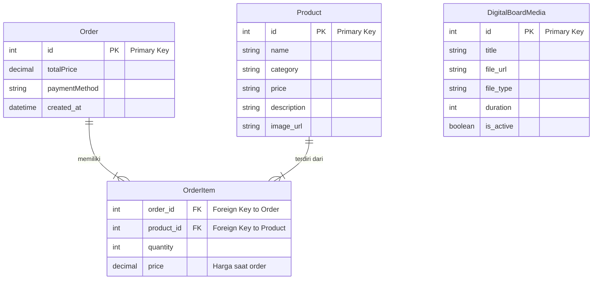

# Diagram ERD Konseptual

Berikut adalah diagram ERD (Entity-Relationship Diagram) konseptual berdasarkan analisis API yang digunakan dalam aplikasi.

## Diagram

## Penjelasan Diagram

1.  **Product**
    *   Ini adalah entitas utama untuk semua item yang bisa dijual (makanan, minuman, dll).
    *   Setiap produk memiliki `id` sebagai kunci unik (Primary Key).

2.  **Order**
    *   Entitas ini merepresentasikan satu transaksi atau pesanan yang dibuat oleh pelanggan.
    *   Setiap pesanan memiliki `id` sebagai kunci unik.

3.  **OrderItem**
    *   Ini adalah **entitas penghubung** (associative entity) antara `Order` dan `Product`.
    *   Sebuah `Order` bisa **memiliki** satu atau banyak `OrderItem`.
    *   Sebuah `Product` bisa **terdiri dari** banyak `OrderItem` di berbagai pesanan yang berbeda.
    *   Entitas ini menyimpan detail seperti `quantity` (jumlah) produk yang dipesan dalam satu `Order`.

4.  **DigitalBoardMedia**
    *   Entitas ini merepresentasikan media promosi (gambar/video) yang ditampilkan saat mode *idle*.
    *   Dalam diagram ini, `DigitalBoardMedia` berdiri sendiri karena **tidak memiliki hubungan database langsung** dengan `Order` atau `Product`. Hubungannya bersifat konseptual di level aplikasi (yaitu untuk mempromosikan produk), bukan di level skema database.

# GEMINI_API_KEY: Required for Gemini AI API calls.
GEMINI_API_KEY="MY_GEMINI_API_KEY"

# APP_URL: The URL where this applet is hosted.
APP_URL="MY_APP_URL"

# ─── MySQL Database (Papan Digital) ───────────────────────────────────────────
DB_HOST="localhost"
DB_PORT="3306"
DB_USER="root"
DB_PASSWORD=""
DB_NAME="gesture_eats"
