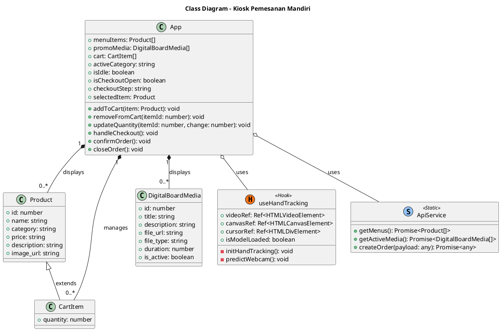
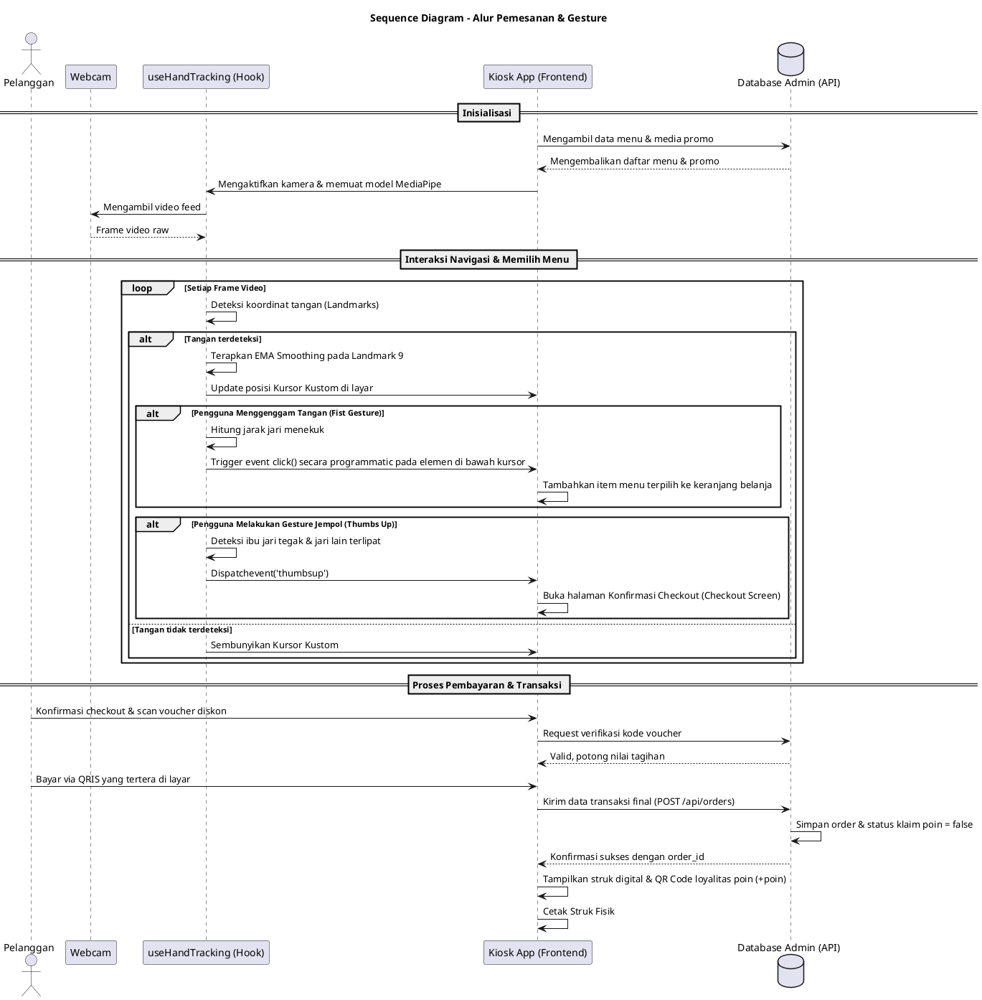
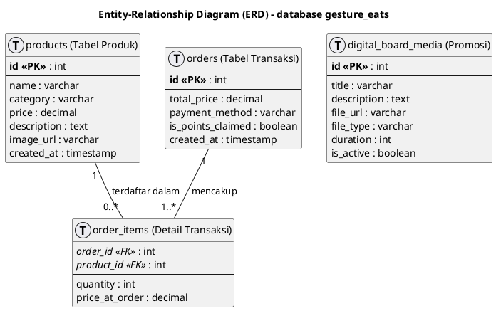

# Dokumentasi Analisis Sistem & Diagram PlantUML
Dokumen ini berisi analisis lengkap arsitektur aplikasi Kios Pemesanan Mandiri berbasis *Air Gesture* (Bakso Masyanto) beserta diagram PlantUML untuk Class Diagram, Sequence Diagram, dan Entity-Relationship Diagram (ERD).

---

## 1. Analisis Fungsional & Sistem Kiosk

Aplikasi ini dirancang sebagai Kios Pemesanan Mandiri tanpa sentuh (*touchless self-ordering kiosk*). Interaksi pengguna sepenuhnya dioperasikan melalui kamera depan (webcam) menggunakan pengenalan gerakan tangan (*Air Gesture*).

### Komponen Utama Sistem
1.  **Antarmuka Pengguna (Kiosk Frontend):**
    *   Dibangun dengan **React, Vite, TypeScript, TailwindCSS, dan Motion**.
    *   Navigasi kategori menu (Bakso, Minuman, dll), daftar menu interaktif, keranjang belanja, proses checkout, serta mode penayangan promosi (*idle loop*) saat tidak digunakan.
2.  **Deteksi Gerakan (useHandTracking Hook):**
    *   Menggunakan library **MediaPipe Tasks Vision** (`HandLandmarker`) yang berjalan lokal di browser.
    *   Kursor dipetakan dari koordinat kamera depan ke area layar menggunakan *Exponential Moving Average (EMA)* dengan koefisien $\alpha = 0.2$ untuk meredam getaran kursor (*jitter*).
    *   **Gesture Menggenggam (Fist/Grab):** Melakukan *click event* secara programmatic pada koordinat kursor.
    *   **Gesture Jempol (Thumbs Up):** Melakukan konfirmasi otomatis untuk langsung masuk ke halaman checkout pesanan (*auto-checkout*).
3.  **Layanan Data (API & Database Web Admin):**
    *   Semua data menu produk, data promosi papan digital, penyimpanan order transaksi, serta pengelolaan kupon/voucher loyalitas poin disimpan terpusat di server database Web Admin MySQL.
    *   Kiosk dan Web Mobile Pelanggan melakukan pemanggilan API HTTP ke Web Admin sebagai *Single Source of Truth*.

---

## 2. Diagram PlantUML

### A. Class Diagram
Diagram ini mendefinisikan struktur kelas, hook, dan relasi data di dalam kode React.

---

### B. Sequence Diagram (Alur Interaksi & Transaksi Utama)
Diagram ini menjelaskan interaksi real-time dari input sensor tangan pengguna hingga pengiriman data pesanan ke backend.

---

### C. Entity-Relationship Diagram (ERD Konseptual Database)
Diagram ini merepresentasikan struktur penyimpanan data di sisi Web Admin (backend terpusat).

