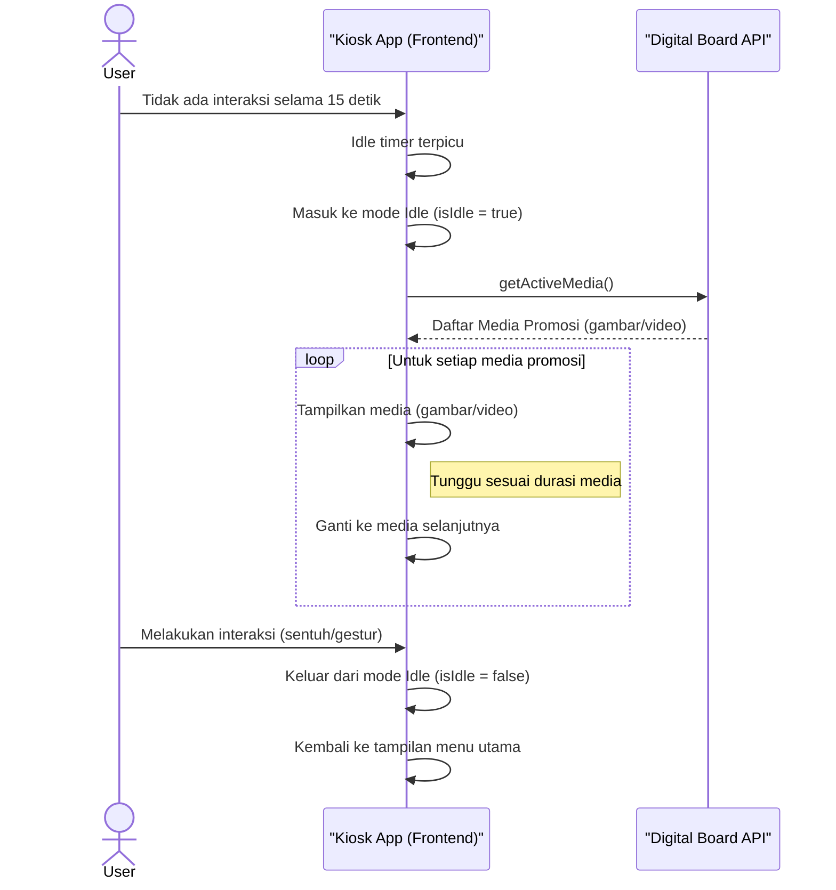

# Diagram Sekuens (Sequence Diagrams)

Berikut adalah diagram sekuens yang menggambarkan alur kerja utama pada aplikasi Kiosk.

## 1. Alur Pemesanan Menu oleh Pengguna

Diagram ini menjelaskan interaksi dari saat pengguna mulai memilih menu hingga pesanan berhasil dibuat.

```mermaid
sequenceDiagram
    actor User
    participant HandTracking as "Hand Tracking Service"
    participant KioskApp as "Kiosk App (Frontend)"
    participant BackendAPI as "Backend API"
    participant PaymentGateway as "Payment Gateway / QRIS"

    %% Alur 1.1: Inisialisasi Aplikasi
    KioskApp->>BackendAPI: getMenus()
    BackendAPI-->>KioskApp: Daftar Produk
    KioskApp->>HandTracking: startTracking()
    HandTracking-->>KioskApp: Model Loaded & Ready

    %% Alur 1.2: Interaksi Pengguna dengan Penanganan Error
    loop Interaksi Menu
        User->>HandTracking: Melakukan gestur (e.g., swipe, point)
        
        alt Gestur Dikenali
            HandTracking->>KioskApp: Send Gesture Event ('swipe-h', 'point-hold')
            
            opt 'point-hold' on menu item
                KioskApp->>KioskApp: Add item to cart with visual feedback
            end
            
            opt 'swipe-h'
                KioskApp->>KioskApp: Change menu category
            end

            opt 'swipe-down' on cart item
                KioskApp->>KioskApp: Remove item from cart
            end

        else Gestur Tidak Dikenali / Ambigius
            HandTracking->>KioskApp: Send Event ('unknown_gesture')
            KioskApp->>KioskApp: Show feedback "Gesture not recognized"
        end
    end

    %% Alur 1.3: Proses Checkout dan Pembayaran
    User->>HandTracking: Melakukan gestur checkout (e.g., 'thumbsup-hold')
    HandTracking->>KioskApp: Send Gesture Event ('checkout_request')
    KioskApp->>KioskApp: Display order confirmation screen

    alt User Confirms Order
        User->>HandTracking: Gestur konfirmasi (e.g., 'pinch-hold' on confirm button)
        HandTracking->>KioskApp: Send Event ('confirm_order')
        
        KioskApp->>BackendAPI: createOrder(cart)
        BackendAPI-->>KioskApp: {orderId, amount, qrCodeData}
        KioskApp->>KioskApp: Display QRIS for payment

        Note over User, KioskApp: User scans QR code with their phone

        loop Poll for Payment Status
            KioskApp->>BackendAPI: checkPaymentStatus(orderId)
            
            alt Payment Success
                BackendAPI-->>KioskApp: {status: 'PAID'}
                KioskApp->>KioskApp: Show success screen & receipt
                break
            else Payment Pending
                BackendAPI-->>KioskApp: {status: 'PENDING'}
                Note right of KioskApp: Wait and poll again
            else Payment Failed/Timeout
                BackendAPI-->>KioskApp: {status: 'FAILED'}
                KioskApp->>KioskApp: Show payment failed screen
                break
            end
        end

    else User Cancels Order
        User->>HandTracking: Gestur batal (e.g., 'open-palm' on cancel button)
        HandTracking->>KioskApp: Send Event ('cancel_order')
        KioskApp->>KioskApp: Return to main menu
    end
```

### Penjelasan Alur Pemesanan:

1.  **Inisialisasi**: Saat aplikasi dimuat, `KioskApp` mengambil data menu dari `BackendAPI` dan mengaktifkan `HandTracking`.
2.  **Interaksi Pengguna**:
    *   `User` melakukan gestur.
    *   `HandTracking` mendeteksi gestur tersebut dan mengirimkan *event* (misalnya 'swipe-h' atau 'point') ke `KioskApp`.
    *   `KioskApp` merespons *event* tersebut dengan mengubah UI, seperti mengganti kategori atau menambahkan item ke keranjang.
3.  **Checkout**:
    *   `User` melakukan gestur untuk checkout.
    *   `KioskApp` menampilkan halaman konfirmasi.
    *   Setelah dikonfirmasi, `KioskApp` mengirim data pesanan (`payload`) ke `BackendAPI`.
    *   `BackendAPI` memproses pesanan dan mengembalikan `orderId`.
    *   `KioskApp` menampilkan layar sukses beserta struk digital.

---

## 2. Alur Tampilan Promosi saat Idle

Diagram ini menjelaskan bagaimana sistem menampilkan media promosi ketika tidak ada interaksi dari pengguna.



### Penjelasan Alur Promosi:

1.  **Mode Idle**: `User` tidak melakukan interaksi apa pun selama 15 detik.
2.  **Ambil Media**: `KioskApp` mendeteksi kondisi *idle*, lalu meminta daftar media promosi yang aktif dari `DigitalBoardAPI`.
3.  **Tampilkan Promosi**:
    *   `KioskApp` menerima daftar media dan mulai menampilkannya satu per satu dalam sebuah *loop*.
    *   Setiap media ditampilkan sesuai dengan `duration` yang ditentukan sebelum beralih ke media berikutnya.
4.  **Keluar dari Idle**: Saat `User` kembali berinteraksi (melalui sentuhan atau gestur), `KioskApp` akan menghentikan mode *idle* dan kembali ke tampilan menu utama.
