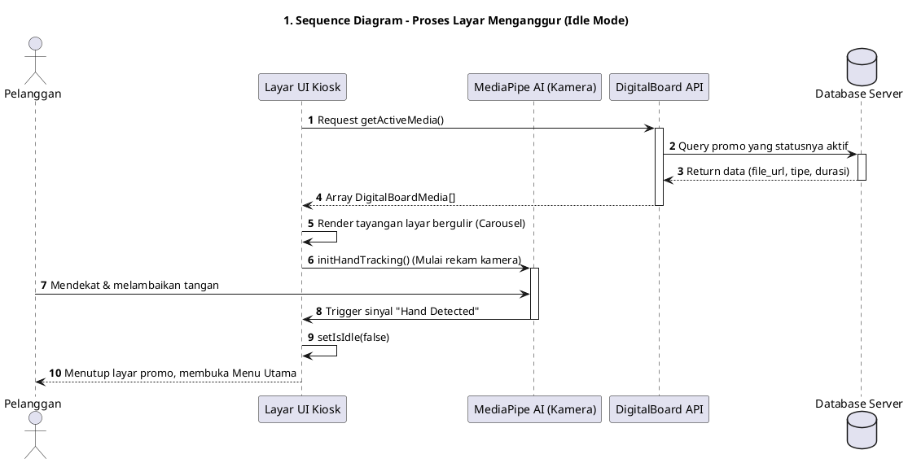
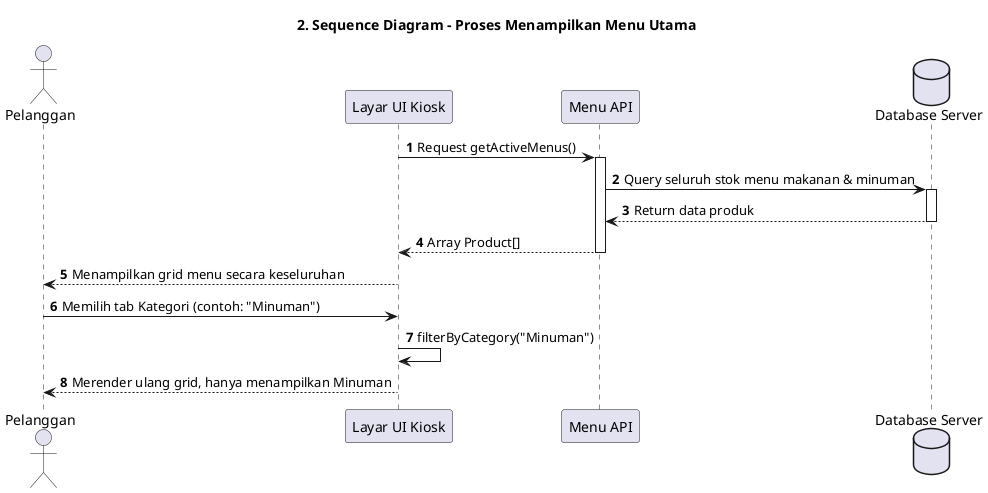
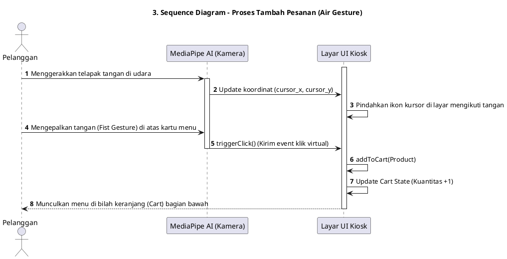
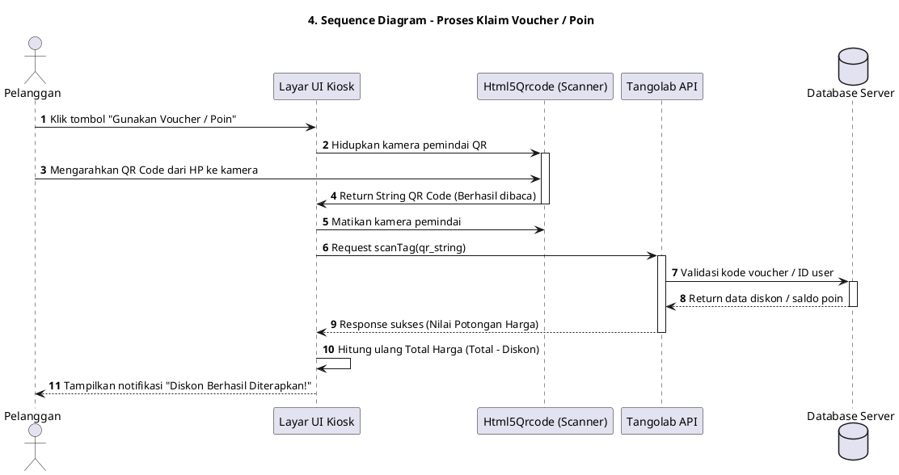
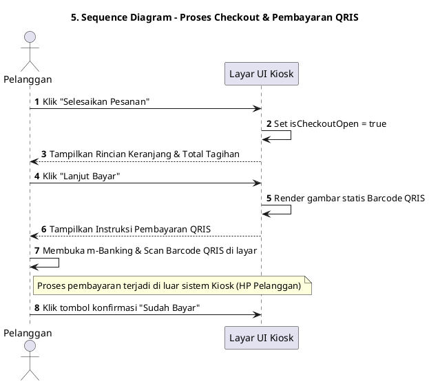
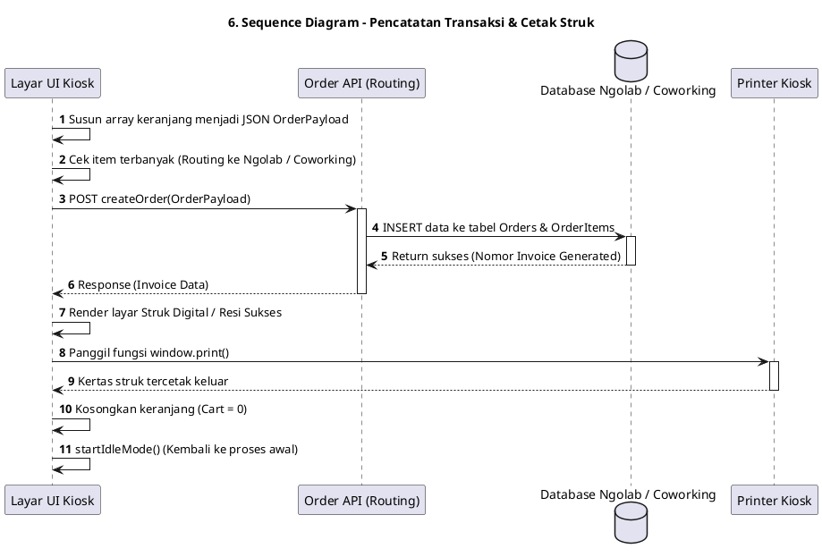

# Sequence Diagrams - Gesture-Eats

## 1. Proses Layar Menganggur (Idle Mode)

## 2. Proses Menampilkan Menu Utama (Browsing)

## 3. Proses Tambah Pesanan (Air Gesture)

## 4. Proses Klaim Voucher / Poin

## 5. Proses Checkout & Pembayaran QRIS

## 6. Pencatatan Transaksi & Cetak Struk

